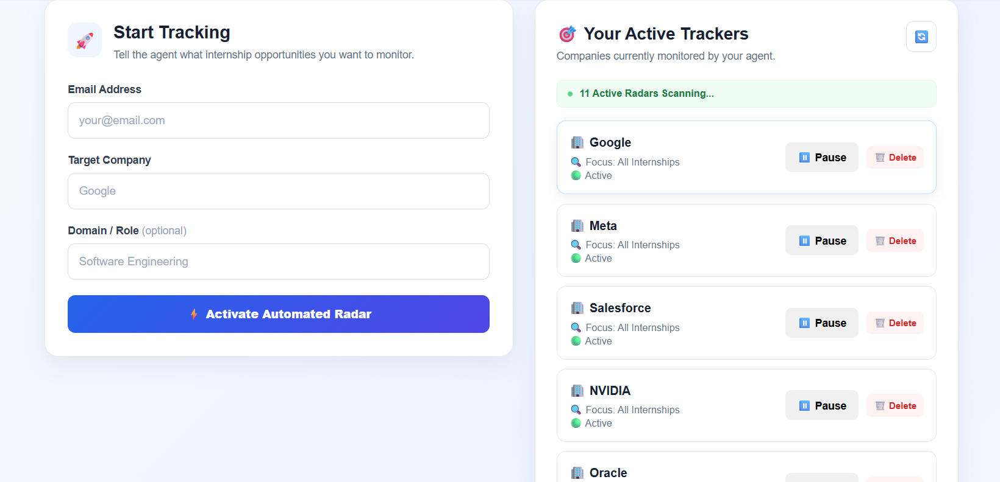
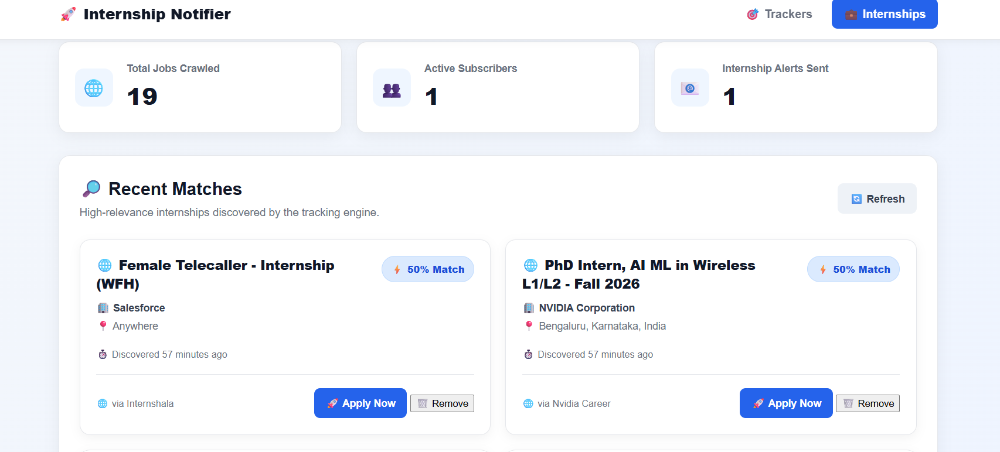
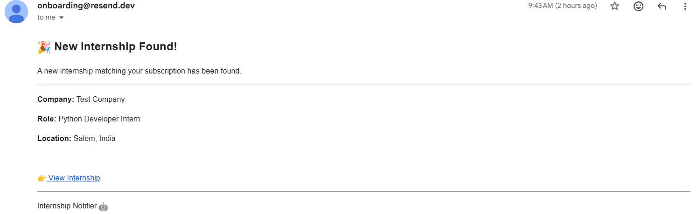
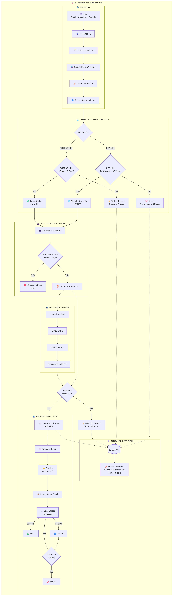

# 🚀 Internship Notifier

An automated internship discovery and notification system that searches for relevant internship opportunities, strictly filters internship listings, ranks them using AI-based semantic relevance scoring, prevents duplicate notifications, and delivers grouped email alerts.

The system is built as a **production-oriented asynchronous application** using FastAPI, PostgreSQL, SerpAPI, APScheduler, ONNX Runtime, and the Brevo API.

It includes automated scheduling, grouped search execution, canonical URL-based internship uniqueness, user-level notification deduplication, notification idempotency, email retry handling, concurrency protection, user-specific dashboard isolation, internship dismissal, and 45-day retention cleanup.

---

## 🌐 Live Demo

**Application:**
`https://internship-notifier.onrender.com`

**GitHub Repository:**
`https://github.com/kokilagurunadhan/internship-notifier`

**Health Check:**
`https://internship-notifier.onrender.com/healthz`

---

## 🖥️ Application Preview


### Subscription Dashboard



### Internship Discovery Dashboard



### Email Notification



---

# 🎯 What Problem Does It Solve?

Finding internships manually across multiple companies and job platforms is repetitive and time-consuming.

Internship Notifier automates the discovery process.

A user provides:

* Email address
* Target company
* Domain / role

The system then searches for relevant internship opportunities, filters invalid listings, scores relevant opportunities, prevents duplicate notifications, and delivers grouped email alerts.

## Core Workflow

```text
Subscription
      ↓
12-Hour Scheduler
      ↓
Group Active Subscriptions
      ↓
One SerpAPI Search per Company + Domain Group
      ↓
Parse / Normalize
      ↓
Strict Internship Type Filter
      ↓
URL / Internship Identity Decision
      ↓
┌─────────────────────────────┐
│                             │
│ NEW URL              EXISTING URL
│   ↓                       ↓
│ Posting Age ≤45d       DB Age ≤7d
│   ↓                       ↓
│ Global Internship      Reuse Global
│ Upsert                 Internship
│   │                       │
└───┴───────────────┬───────┘
                    ↓
        User-Specific Notification Check
                    ↓
          Calculate Relevance Score
                    ↓
               Score ≥ 50?
              ↙          ↘
            NO            YES
            ↓              ↓
      LOW_RELEVANCE     PENDING
      No Notification      ↓
                     Group by Email
                          ↓
                    Priority / Max 15
                          ↓
                      Idempotency
                          ↓
                    Email Dispatcher
                     ↙           ↘
                   SENT         RETRY
                                  ↓
                               FAILED
```

The 45-day database retention cleanup is a separate maintenance process.

---

# 🏗️ System Architecture



The production-oriented architecture consists of:

```text
                          ┌─────────────────────┐
                          │        USER         │
                          │ Email + Company +   │
                          │ Domain / Role       │
                          └──────────┬──────────┘
                                     │
                                     ▼
                          ┌─────────────────────┐
                          │    SUBSCRIPTION     │
                          │     PostgreSQL      │
                          └──────────┬──────────┘
                                     │
                                     ▼
                          ┌─────────────────────┐
                          │   12-HOUR SCHEDULER │
                          │     APScheduler     │
                          └──────────┬──────────┘
                                     │
                                     ▼
                          ┌─────────────────────┐
                          │   SEARCH GROUPING   │
                          │ Company + Domain    │
                          └──────────┬──────────┘
                                     │
                                     ▼
                          ┌─────────────────────┐
                          │       SerpAPI       │
                          │   One Search/Group  │
                          └──────────┬──────────┘
                                     │
                                     ▼
                          ┌─────────────────────┐
                          │  PARSE / NORMALIZE  │
                          └──────────┬──────────┘
                                     │
                                     ▼
                          ┌─────────────────────┐
                          │ STRICT INTERNSHIP   │
                          │       FILTER       │
                          └──────────┬──────────┘
                                     │
                                     ▼
                          ┌─────────────────────┐
                          │    URL DECISION     │
                          └──────────┬──────────┘
                                     │
                       ┌─────────────┴─────────────┐
                       │                           │
                       ▼                           ▼
                ┌──────────────┐           ┌──────────────┐
                │    NEW URL   │           │ EXISTING URL │
                └──────┬───────┘           └──────┬───────┘
                       │                           │
                       ▼                           ▼
                ┌──────────────┐           ┌──────────────┐
                │ Posting Age  │           │ DB Age ≤ 7d? │
                │    ≤45d?     │           └──────┬───────┘
                └──────┬───────┘                  │
                       │                          ▼
                       ▼                   ┌──────────────┐
                ┌──────────────┐           │    REUSE     │
                │    GLOBAL    │           │    GLOBAL    │
                │  INTERNSHIP  │           │  INTERNSHIP  │
                │    UPSERT    │           └──────┬───────┘
                └──────┬───────┘                  │
                       │                          │
                       └─────────────┬────────────┘
                                     │
                                     ▼
                          ┌─────────────────────┐
                          │ USER-SPECIFIC       │
                          │ NOTIFICATION CHECK  │
                          └──────────┬──────────┘
                                     │
                                     ▼
                          ┌─────────────────────┐
                          │ ALREADY NOTIFIED    │
                          │ WITHIN 7 DAYS?      │
                          └──────────┬──────────┘
                                     │
                              ┌──────┴──────┐
                              │             │
                             YES           NO
                              │             │
                              ▼             ▼
                            STOP    ┌─────────────────┐
                                    │ AI RELEVANCE    │
                                    │    SCORING      │
                                    └────────┬────────┘
                                             │
                                             ▼
                                    ┌─────────────────┐
                                    │   SCORE ≥ 50?   │
                                    └────────┬────────┘
                                             │
                                    ┌────────┴────────┐
                                    │                 │
                                   NO                YES
                                    │                 │
                                    ▼                 ▼
                             ┌──────────────┐   ┌──────────────┐
                             │ LOW_RELEVANCE│   │    PENDING   │
                             │ No Notification│ │ Notification │
                             └──────────────┘   └──────┬───────┘
                                                       │
                                                       ▼
                                              ┌────────────────┐
                                              │ GROUP BY EMAIL │
                                              └───────┬────────┘
                                                      │
                                                      ▼
                                              ┌────────────────┐
                                              │ PRIORITY /     │
                                              │ MAX 15 JOBS    │
                                              └───────┬────────┘
                                                      │
                                                      ▼
                                              ┌────────────────┐
                                              │  IDEMPOTENCY   │
                                              └───────┬────────┘
                                                      │
                                                      ▼
                                              ┌────────────────┐
                                              │ EMAIL DISPATCH │
                                              │  BREVO API     │
                                              └───────┬────────┘
                                                      │
                                               ┌──────┴──────┐
                                               │             │
                                               ▼             ▼
                                             SENT          RETRY
                                                               │
                                                               ▼
                                                            FAILED
```

---

# 🤖 AI Relevance Engine

The project uses **`all-MiniLM-L6-v2`** to calculate semantic similarity between a user's requested domain/role and internship content.

The production semantic pipeline is:

```text
all-MiniLM-L6-v2
        ↓
QInt8 ONNX Model
        ↓
ONNX Runtime
        ↓
Tokenization
        ↓
Mean Pooling
        ↓
L2 Normalization
        ↓
Cosine Similarity
        ↓
Semantic Score
```

The relevance engine combines keyword-based and semantic signals.

Only opportunities meeting the production threshold continue to notification creation:

```text
Minimum Relevance Score = 50
```

## Why ONNX?

The original PyTorch-based model was converted to ONNX and dynamically quantized to QInt8.

This provides:

* Lower runtime memory usage
* Smaller production model footprint
* Reduced heavy ML dependencies
* CPU-friendly inference
* Better suitability for constrained deployment environments

The optimized model was validated against the original implementation.

---

# 🔎 Automated Internship Discovery

The system automatically searches for internships using SerpAPI.

To reduce unnecessary API usage, active subscriptions are grouped by:

```text
Company + Domain
```

For each unique search group, the scheduler performs **one SerpAPI request per scheduler cycle**.

For example:

```text
Amazon + software
Amazon + data
Google + software
Microsoft + software
```

Each unique group results in one search request during that scheduler cycle.

The search pipeline is:

```text
Active Subscriptions
        ↓
Group by Company + Domain
        ↓
Search Query Generation
        ↓
One SerpAPI Request per Group
        ↓
Parse Search Results
        ↓
Normalize Jobs
        ↓
Continue Through Production Pipeline
```

A failure in one search group does not stop the remaining groups from being processed.

The production search layer uses:

* Company/domain-based grouping
* One request per search group
* Request timeout protection
* HTTP error detection
* Network failure handling
* Search failure isolation
* Multi-company failure isolation

SerpAPI failures do not deactivate subscriptions and do not create notifications for the failed search group. The next scheduled cycle can attempt the search again.

---

# 🎯 Strict Internship Filtering

Search engines can return many job types that are not internships.

The system therefore performs strict internship-type validation before relevance scoring.

```text
Search Result
     ↓
Parse
     ↓
Normalize
     ↓
Internship Type Verification
     ↓
Valid Internship
```

Invalid opportunities are rejected before entering the relevance pipeline.

---

# 🛡️ Duplicate Protection

The system uses multiple layers of duplicate protection.

## 1. Global Internship URL Uniqueness

Internships are identified using canonicalized URLs.

For example:

```text
https://example.com/job/123
```

and:

```text
https://example.com/job/123?utm_source=google
```

can resolve to the same canonical URL.

This prevents tracking parameters and URL variations from creating duplicate global internship records.

---

## 2. New Internship Posting Age

For a completely new URL:

```text
New URL
   ↓
Posting Age ≤45 Days?
   ↓
YES → Save
NO  → Reject
```

This prevents very old postings from entering the system.

---

## 3. Existing Internship Age

If the URL already exists globally:

```text
Existing URL
      ↓
Internship DB Age ≤7 Days?
      ↓
YES → Reuse
NO  → Treat as stale
```

This is separate from the 45-day new-posting rule.

---

## 4. User Notification Duplicate Protection

A user cannot repeatedly receive the same internship within the configured 7-day notification window.

```text
Same Internship
      ↓
Already Notified User?
      ↓
YES → STOP
NO  → Continue
```

Global internship identity and user notification history remain separate.

---

# 👤 User-Specific Dashboard Isolation

The application keeps global internship records separate from user-specific notification records.

The relationship is conceptually:

```text
                 GLOBAL
              ┌────────────┐
              │ Internship │
              └─────┬──────┘
                    │
          ┌─────────┴─────────┐
          │                   │
          ▼                   ▼
   ┌──────────────┐    ┌──────────────┐
   │ Notification │    │ Notification │
   │    User A    │    │    User B    │
   └──────────────┘    └──────────────┘
```

The internship dashboard is filtered using the user's email.

Therefore:

```text
No user email
     ↓
Empty dashboard
```

and:

```text
Known user email
     ↓
Only that user's notifications
     ↓
Only that user's visible internships
```

The browser stores the user's email in `localStorage` after subscription.

This provides functional user-level data isolation for the current application. It is **not a replacement for authentication**, since browser-side local storage can be modified by the user.

---

# 🚫 User-Specific Internship Dismissal

A user can remove an internship from their dashboard without deleting the global internship record.

Dismissal is stored separately using a user/internship relationship.

```text
Global Internship
       ↓
User Dashboard
       ↓
Remove
       ↓
InternshipDismissal
       ↓
Hidden for that User
```

The global internship remains available for other users.

This prevents one user's dashboard action from deleting an internship from the shared internship catalogue.

---

# 👥 Multiple Subscriptions Per User

A user can track multiple companies and domains using the same email address.

Subscription uniqueness is based on:

```text
user_email + company + domain
```

For example, all of the following can coexist:

```text
user@example.com + Amazon + software

user@example.com + Google + software

user@example.com + Microsoft + software

user@example.com + Amazon + data

user@example.com + Google + backend
```

But an exact duplicate such as:

```text
user@example.com + Amazon + software
```

cannot be inserted twice.

Cancelled subscriptions can also be reactivated instead of creating duplicate records.

---

# ⏰ Automated 12-Hour Scheduler

The internship discovery process runs automatically every:

```text
12 hours
```

The scheduler uses:

* APScheduler
* UTC timezone
* Maximum one concurrent scheduler instance
* Coalescing of missed executions
* Subscription-group failure isolation

Configuration:

```text
CHECK_INTERVAL_MINUTES = 720

MAX_INSTANCES = 1

COALESCE = true
```

The scheduler invokes the production internship discovery pipeline.

---

# 📧 Notification System

Notifications are created before email delivery.

The notification lifecycle is:

```text
PENDING
   ↓
PROCESSING
   ├──────────────→ SENT
   │
   └──────────────→ RETRY
                      ↓
                  PROCESSING
                      │
                      └────────────→ FAILED
```

The dispatcher supports:

* Pending notifications
* Atomic notification claiming
* Processing state
* Email grouping by recipient
* Maximum 15 internships per email
* Persistent idempotency keys
* Retry handling
* Maximum retry attempts
* Concurrent email limits
* Zombie-processing recovery
* Permanent failure handling

---

# 🔐 Notification Idempotency

Every notification receives a persistent idempotency key.

The same key is reused during retries.

```text
Notification
     ↓
Persistent Idempotency Key
     ↓
Email Attempt
     ↓
Failure
     ↓
Retry
     ↓
Same Idempotency Key
```

This prevents retries from accidentally generating duplicate email operations.

---

# 🔄 Email Retry Handling

Failed email attempts remain retryable.

Production configuration:

```text
Maximum Attempts: 5
Base Retry Delay: 5 minutes
```

The lifecycle is:

```text
Attempt 1
   ↓
Failure
   ↓
Retry
   ↓
Attempt 2
   ↓
Failure
   ↓
Retry
   ↓
...
   ↓
Attempt 5
   ↓
FAILED
```

After the maximum retry count is reached, the notification is permanently marked:

```text
FAILED
```

---

# 🛡️ Concurrency Safety

The notification dispatcher uses database row locking to prevent multiple workers from processing the same notification.

Notification claiming uses:

```sql
SELECT ... FOR UPDATE SKIP LOCKED
```

This allows concurrent workers to safely claim different notifications without processing the same notification simultaneously.

A concurrent notification creation test verified:

```text
10 concurrent workers
        ↓
1 notification created
        ↓
9 duplicate attempts blocked
```

The database uniqueness constraint prevents duplicate notification records.

---

# 🧟 Zombie Processing Recovery

If a notification remains in:

```text
PROCESSING
```

for longer than the configured processing timeout, it can be recovered and returned to a retryable state.

Current processing timeout:

```text
15 minutes
```

This protects the system from permanently stuck notification records.

---

# 🧹 45-Day Database Retention

The system performs database retention cleanup separately from the new-job posting-age filter.

Internships that have not been seen for more than 45 days are removed.

The cleanup uses:

```text
last_seen_at
```

rather than `created_at`.

This means an internship originally created more than 45 days ago can remain in the database if it is still being rediscovered.

```text
last_seen_at > 45 days
        ↓
DELETE Internship
        ↓
Related Notifications
        ↓
Cascade Delete
```

The retention cleanup was tested with both old and recently seen internships.

---

# 🗄️ Database

The application uses:

* PostgreSQL
* SQLAlchemy
* asyncpg
* Alembic
* pgvector

## Main Entities

```text
┌────────────────────┐
│    Subscription    │
└─────────┬──────────┘
          │
          ▼
┌────────────────────┐
│    Notification    │
└─────────┬──────────┘
          │
          ▼
┌────────────────────┐
│     Internship     │
└────────────────────┘

┌────────────────────┐
│ InternshipDismissal│
└────────────────────┘
```

## Subscription

Important fields include:

```text
id
user_email
company
domain
is_active
status
created_at
```

## Internship

Important fields include:

```text
id
title
company
location
url
description
source
via
relevance_score
passed_filter
created_at
last_seen_at
```

## Notification

Important fields include:

```text
id
subscription_id
internship_id
user_email
status
relevance_score
retry_count
next_retry_at
idempotency_key
created_at
```

## InternshipDismissal

Important fields include:

```text
id
user_email
internship_id
dismissed_at
```

A unique user/internship constraint prevents duplicate dismissal records.

---

# 📬 Notification Grouping

Notifications are created individually for users and internships.

Before email delivery, pending notifications are grouped by normalized email address.

```text
User A

 ├── Internship 1
 ├── Internship 2
 └── Internship 3


User B

 ├── Internship 4
 └── Internship 5
```

The dispatcher then creates grouped email digests.

Maximum:

```text
15 internships per email
```

Jobs are prioritized before the final email is generated.

---

# 🧪 Testing

The project has a comprehensive automated regression and production-hardening test suite.

Current full regression:

```text
193 passed in 14.27s
```

Test coverage includes:

* URL canonicalization
* Global internship uniqueness
* Subscription uniqueness
* Multiple subscriptions per user
* Subscription reactivation
* Strict internship filtering
* Relevance scoring
* Relevance threshold boundaries
* ONNX scorer validation
* 7-day notification protection
* Notification idempotency
* Concurrent notification creation
* Email retry handling
* Maximum retry failure
* 45-day retention cleanup
* Scheduler configuration
* API behavior
* Database behavior
* Production configuration

---

# 🌐 Production Verification

The production environment has been verified across the main application workflow.

The verified flow is:

```text
Active Subscription
       ↓
12-Hour Scheduler
       ↓
Grouped SerpAPI Search
       ↓
Internship Discovery
       ↓
Strict Filtering
       ↓
Relevance Scoring
       ↓
Notification Creation
       ↓
Notification Dispatcher
       ↓
Brevo API
       ↓
Email Delivery
       ↓
Notification = SENT
```

The production environment also verified reuse of existing internships and the user-level 7-day notification protection.

```text
Existing Internship
       ↓
Reuse Global Internship
       ↓
7-Day Notification Check
       ↓
Previously Notified
       ↓
No Duplicate Notification
```

---

# 🩺 Health Monitoring

The application exposes:

```http
GET /healthz
```

Expected healthy response:

```json
{
  "status": "healthy",
  "database": "connected"
}
```

The endpoint verifies that the application is running and can connect to PostgreSQL.

---

# 🌐 Deployment

The application is deployed using a Render Web Service.

```text
Render Web Service
        │
        ├── FastAPI
        │
        ├── PostgreSQL
        │
        ├── SerpAPI
        │
        ├── Brevo API
        │
        ├── APScheduler
        │
        └── ONNX Runtime
```

Production configuration is supplied through environment variables.

The scheduler is enabled in production using:

```text
SCHEDULER_ENABLED=true
```

---

# 🛠️ Technology Stack

| Category                | Technology                 |
| ----------------------- | -------------------------- |
| Language                | Python                     |
| Backend                 | FastAPI                    |
| Database                | PostgreSQL                 |
| ORM                     | SQLAlchemy                 |
| Database Driver         | asyncpg                    |
| Migrations              | Alembic                    |
| Search                  | SerpAPI                    |
| AI Model                | all-MiniLM-L6-v2           |
| AI Runtime              | ONNX Runtime               |
| Model Optimization      | QInt8 Dynamic Quantization |
| Tokenization            | Hugging Face Tokenizers    |
| Scheduler               | APScheduler                |
| Email                   |Brevo API                     |
| Vector Database Support | pgvector                   |
| Frontend                | HTML, CSS, JavaScript      |
| Testing                 | Pytest                     |
| Deployment              | Render                     |
| Version Control         | Git / GitHub               |

---

# 📁 Project Structure

```text
internship-notifier/

│
├── app/
│   ├── api/
│   │   ├── internships.py
│   │   └── subscriptions.py
│   │
│   ├── database/
│   │   └── database.py
│   │
│   ├── models/
│   │   ├── internship.py
│   │   ├── notification.py
│   │   ├── subscription.py
│   │   └── internship_dismissal.py
│   │
│   ├── schemas/
│   │
│   └── services/
│       ├── internship_search.py
│       ├── internship_service.py
│       ├── notification_dispatcher.py
│       ├── pipeline_processor.py
│       ├── scheduler.py
│       └── semantic_scorer.py
│
├── frontend/
│   ├── index.html
│   ├── style.css
│   ├── script.js
│   ├── internships.html
│   ├── internships.css
│   └── internships.js
│
├── model_onnx/
│   ├── config.json
│   ├── model_quantized_qint8.onnx
│   ├── tokenizer.json
│   ├── tokenizer_config.json
│   ├── special_tokens_map.json
│   └── vocab.txt
│
├── scripts/
│   ├── export_onnx.py
│   ├── compare_onnx.py
│   └── verification scripts
│
├── tests/
│
├── alembic/
│
├── main.py
├── requirements.txt
├── .env.example
└── README.md
```

---

# 🚀 Local Setup

## 1. Clone the repository

```bash
git clone https://github.com/kokilagurunadhan/internship-notifier.git

cd internship-notifier
```

## 2. Create a virtual environment

### Windows

```powershell
python -m venv venv
venv\Scripts\activate
```

### Linux / macOS

```bash
python -m venv venv
source venv/bin/activate
```

## 3. Install dependencies

```bash
pip install -r requirements.txt
```

## 4. Configure environment variables

Create:

```text
.env
```

using:

```text
.env.example
```

Required configuration:

```text
DATABASE_URL=
SERPAPI_API_KEY=
BERVO_EMAIL=
BERVO_APP_PASSWORD=
BERVO_HOST=bervo.gmail.com
BERVO_PORT=465
FROM_EMAIL=
FROM_EMAIL=
SCHEDULER_ENABLED=
CORS_ORIGINS=
```

Never commit real credentials.

## 5. Run database migrations

```bash
alembic upgrade head
```

## 6. Start the application

```bash
uvicorn main:app --reload
```

---

# 📡 API Endpoints

## Health

```http
GET /healthz
```

## Dashboard

```http
GET /dashboard
```

## Internships

```http
GET /internships?user_email=<email>
```

The internship dashboard is scoped to the requested user email.

## Companies

```http
GET /companies
```

## Subscriptions

```http
POST /subscriptions
```

User-specific subscription listing:

```http
GET /subscriptions?user_email=<email>
```

Subscription operations also support:

* Listing subscriptions
* Pausing subscriptions
* Resuming subscriptions
* Deleting subscriptions

## Internship Search

```http
GET /search-internships
```

---

# 🔐 Environment & Security

Production secrets are supplied through environment variables.

The repository does not contain real credentials.

Important environment variables include:

```text
DATABASE_URL
SERPAPI_API_KEY
BERVO_EMAIL
BERVO_APP_PASSWORD
BERVO_HOST
BERVO_PORT
FROM_EMAIL
FROM_EMAIL
SCHEDULER_ENABLED
CORS_ORIGINS
```

The scheduler is enabled in production using:

```text
SCHEDULER_ENABLED=true
```

The local development environment can keep the scheduler disabled when manual testing is preferred.

---

# 📊 Production Reliability

The system includes multiple production-oriented safeguards:

* Async database access
* PostgreSQL persistence
* Database uniqueness constraints
* Canonical URL normalization
* Batched database queries
* Grouped search execution
* Request timeout protection
* Search failure isolation
* Subscription-group failure isolation
* User-level notification deduplication
* Notification idempotency
* Concurrent notification protection
* Atomic notification claiming
* Email retry handling
* Maximum retry limits
* Zombie notification recovery
* Maximum email concurrency
* Maximum 15 jobs per email
* 45-day database retention
* User-specific internship dismissal
* User-specific dashboard filtering
* Health monitoring
* Environment-based configuration
* CORS configuration
* Automated regression testing
* Production verification

---

# 🎓 What This Project Demonstrates

This project demonstrates practical experience with:

## Backend Engineering

* FastAPI
* REST API development
* Asynchronous Python
* SQLAlchemy
* PostgreSQL
* Database transactions
* Database constraints
* Database indexing

## Automation

* APScheduler
* Scheduled background processing
* External API integration
* Search automation
* Email automation

## AI / ML Engineering

* Semantic similarity
* Sentence embeddings
* all-MiniLM-L6-v2
* ONNX model conversion
* QInt8 quantization
* ONNX Runtime
* Mean pooling
* L2 normalization
* Cosine similarity

## Reliability Engineering

* Idempotency
* Retry mechanisms
* Concurrency control
* Database locking
* Duplicate prevention
* Failure isolation
* Retention cleanup
* Zombie-process recovery

## Software Engineering

* Automated testing
* Production debugging
* Environment configuration
* Git/GitHub
* Deployment
* API validation
* Security practices

---

# 🔮 Future Improvements

Potential future improvements include:

* Additional internship data sources
* Improved personalization
* More advanced ranking models
* User authentication
* Analytics dashboards
* More sophisticated search strategies
* Additional notification channels
* Distributed background processing when scale requires it

These improvements are intentionally outside the current production architecture.

---

# 👨‍💻 Author

**Kokila Gurunadhan**

Electronics & Communication Engineering student building production-oriented software and AI-assisted systems.

---

# 📌 Project Status

## Production-Oriented Student Project

Current verification:

```text
Automated regression tests       : 193 passed
Production database             : Connected
Production email delivery       : Verified
Scheduler                       : 12-hour interval
AI relevance scoring             : ONNX Runtime + QInt8
Duplicate protection             : Verified
7-day notification protection    : Verified
Notification idempotency         : Verified
Email retry handling             : Verified
Concurrency protection           : Verified
45-day retention                 : Verified
Production workflow              : Verified
```

The application is deployed and the core internship discovery → filtering → relevance → notification → email workflow has been verified.

The architecture separates the **global internship catalogue** from **user-specific notifications and dashboard state**, allowing multiple users to benefit from the same discovered internship while maintaining user-level notification and dismissal behavior.
